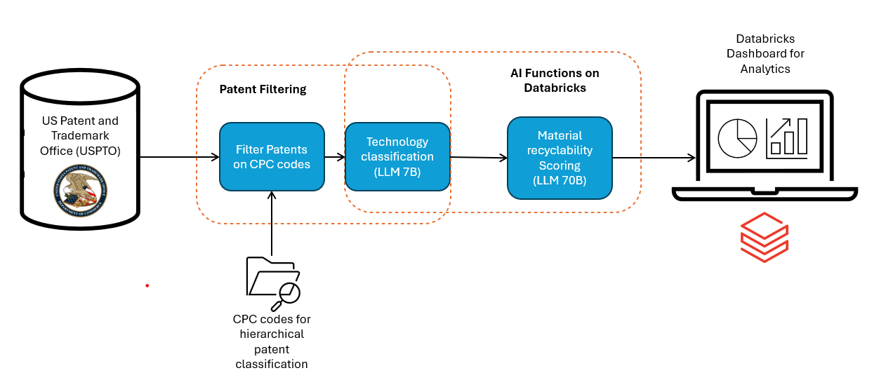
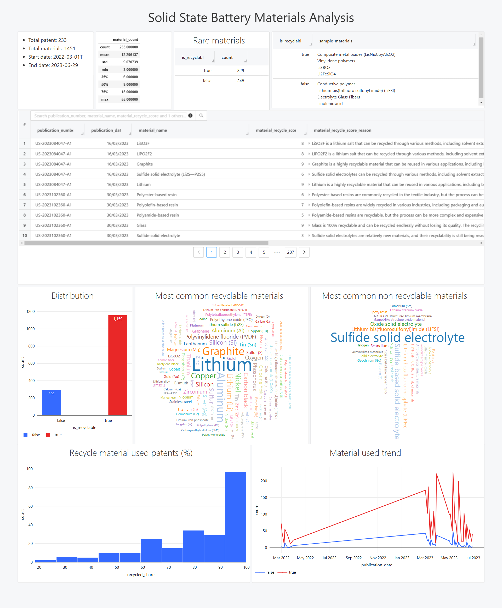

# CIRCLE-AI
Submission for Hackathon: Generative AI World Cup 2024 Hosted by Databricks

[Presentation Recording](https://vimeo.com/1025189370)

## Overview

**CIRCLE-AI** is the Circular Innovation Recycling Classification & Learning Engine, designed to revolutionize how we assess material recyclability in emerging technologies. By leveraging AI and publicly available patent data, CIRCLE-AI automates complex processes and provides insightful data that can drive innovation in recycling and materials management.

## Features

- 🤖 **Automated AI Functions:**
  - Patent analysis
  - Material identification
  - Recyclability assessment

- 📑 **Insight Extraction:**
  - Analysis of emerging technologies
  - Identification of material composition patterns
  - Evaluation of recyclability methods

- 🎯 **Target Users:**
  - Technology Companies (R&D)
  - Materials Manufacturers
  - Recycling Companies
  - Research Institutions

## Workflow

## Technologies

- **Databricks:** For running AI functions and managing data.
- **PySpark:** To handle large-scale data processing.
- **Databricks Dashboard:** The primary output is provided as an HTML export for user interaction.

## Patent Data

- https://www.kaggle.com/competitions/uspto-explainable-ai/data

## Installation Instructions

1. **Set Up Databricks:**
   - Create an account on Databricks if you don't have one.
   - Set up a workspace for your project.

2. **Import Notebooks:**
   - Upload the provided notebooks and necessary data files to your Databricks environment.

3. **Run Notebooks:**
   - Run notebooks including filtering, classification, material extraction and visualisation (as shown in the workflow above).
   
## Usage

- **Interactive Dashboard:**
  - Open the exported HTML file to view and interact with the dashboard. A sample example is available for solid-state batteries.

- **Custom Projects:**
  - Utilize the provided notebooks to run analyses on different technology use cases as per your needs.

## Demo / Screenshots

## Case Study
Circular Innovation Recycling Classification & Learning Engine - We want to analyze how well patents in solid-state-battery technology are considering the recycling aspect. We think this is highly relevant, as this technology might become disruptive to the current lithium battery technology, and the large amount of such batteries produced might have significant environmental impact. The approach is easily expandable to other technologies and aspects of interests. By mapping the patents to their owners people can also check which companies are most engage in circular innovation - and if this engagement relates to their enviromental engagement claims.

## Team Members

- Subash Ale Magar
- Christoph Hartmann
- Barbara Aghanenu
- James Gray

### Team Name

**LNIP rulez**

### Competition

**Generative AI World Cup 2024: So you think you can hack**  
Hosted by **Databricks**

## Future Plans

- Automate the analysis process for various technologies.
- Standardize results and enhance analytical capabilities.
- Conduct in-depth material analyses and suggest optimal material replacements.
